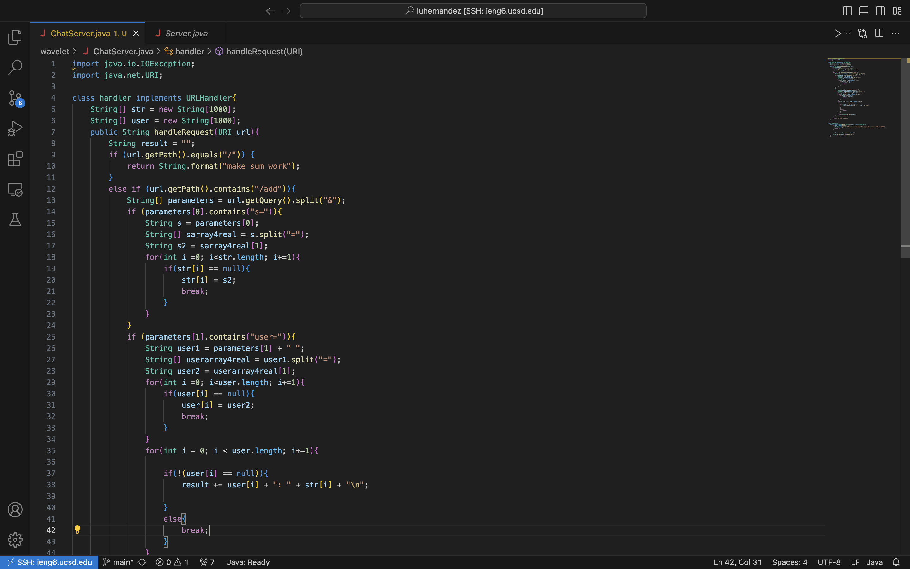
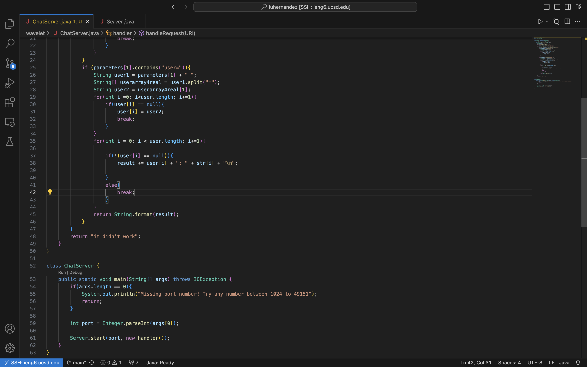
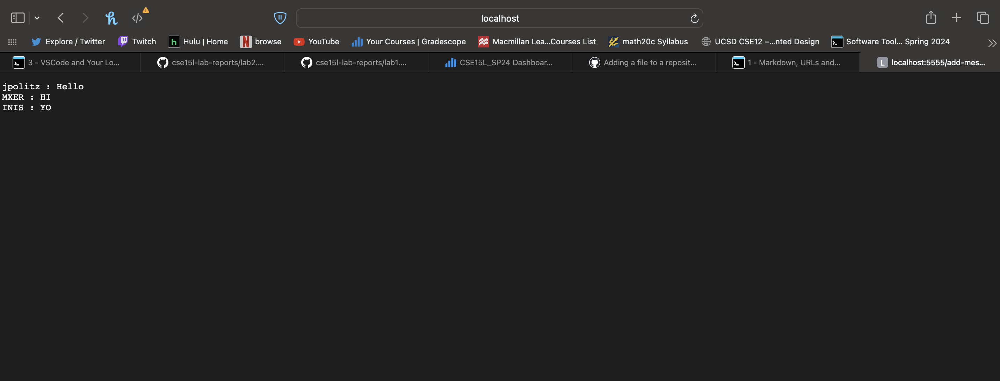
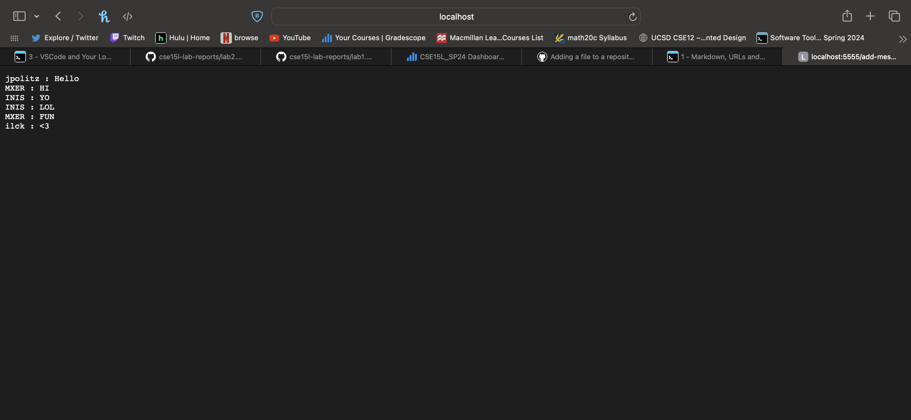
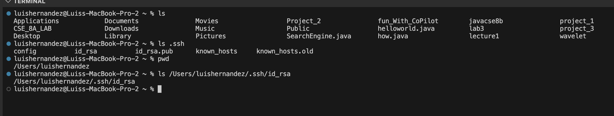
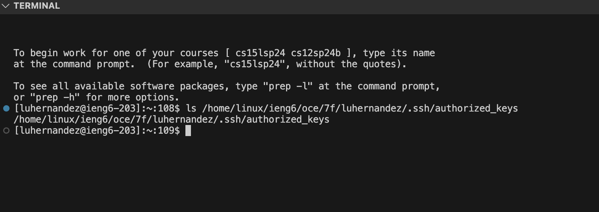
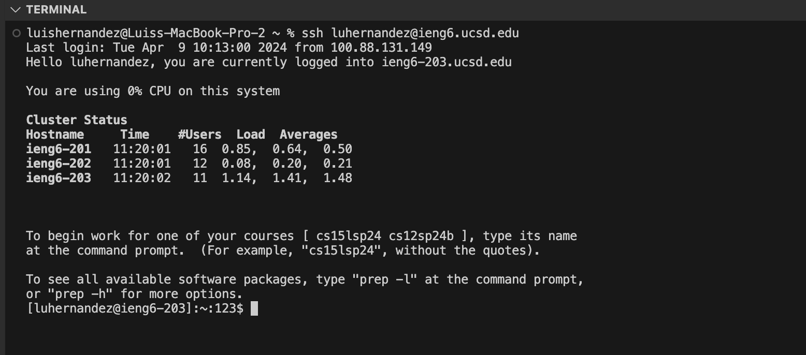

# Lab Report 1 - Servers & SSH Keys

## Part 1
### Code:

--- ---
### Use /add-message:

There is only one method called in my first screenshot and that is the handle request method which returns a string. Important values in this screen shot is the `String[]` str, which holds what the users mesaage is, the array of strings `String[]` user, which hold what the input for the username is, the `String` result, which holds what will be outputed, the `String[]` parameters, which is used to ensure that the input the user made was correct. 

There is only one method called in my first screenshot and that is the handle request method which returns a string. Important values in this screen shot is the `String[]` str, which holds what the users mesaage is, the array of strings `String[]` user, which hold what the input for the username is, the `String` result, which holds what will be outputed, the `String[]` parameters, which is used to ensure that the input the user made was correct. 

## Part 2
1.) 
2.) 
3.) 

## Part 3

Something I learned in lab week 2 was that UCSD had its own remote server, in which falculty and students attending can access it through their email and password. Another thing I learned in lab week 2 was that through terminal we can complie code with an input and it can give us a url that can on ly be accessed through our device, as well as the ability to change what the website outputs through editing the url. Something I learned in lab week 3 is that we can access the remote server through vs code as well and not just the terminal. 
