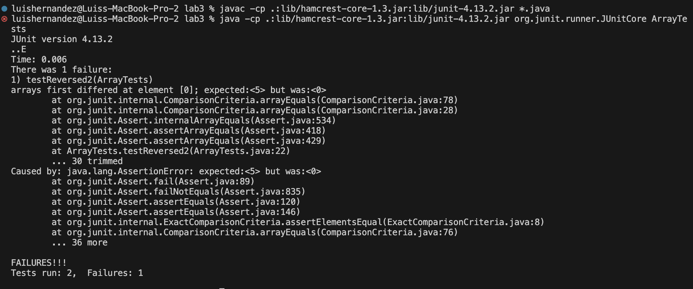

# Lab Report 3 - Bugs & Commands

## Par 1- Bugs
```
  @Test
  public void testReverseInPlace2(){
    int[] input = {5, 4, 3, 2, 1};
    ArrayExamples.reverseInPlace(input);
    assertArrayEquals(new int[] {1, 2, 3, 4, 5}, input);
  }
```

```
@Test
  public void test2(){
    int[] input = {1,1};
    ArrayExamples.reverseInPlace(input);
    assertArrayEquals(new int[] {1, 1}, input);
  }
```


```
 static void reverseInPlace(int[] arr) {
    for(int i = 0; i < arr.length; i += 1) {
      arr[i] = arr[arr.length - i - 1];
    }
  }
```

```
   static void reverseInPlace(int[] arr) {
     int[] arrClone = arr.clone();
     for(int i = 0; i < arr.length; i += 1) {
       arr[i] = arrClone[arr.length - i - 1];
     }
   }
```
