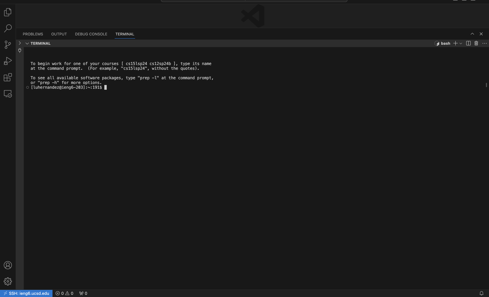
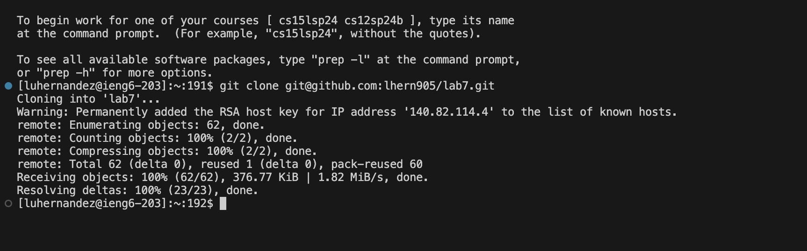
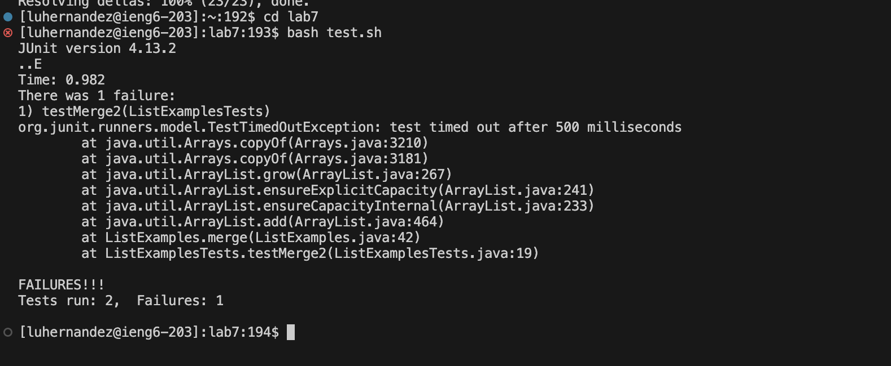
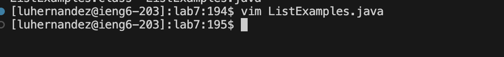
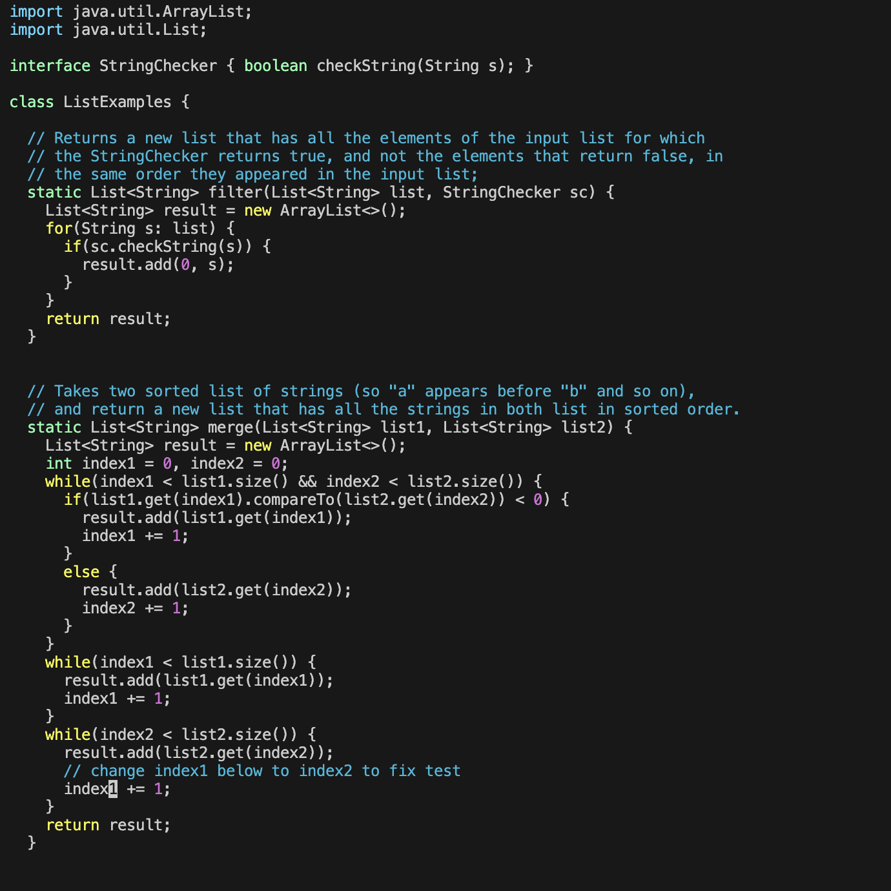
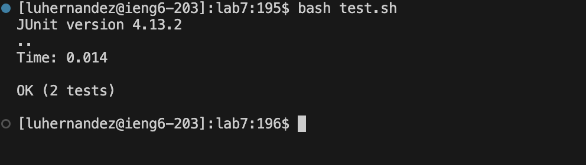
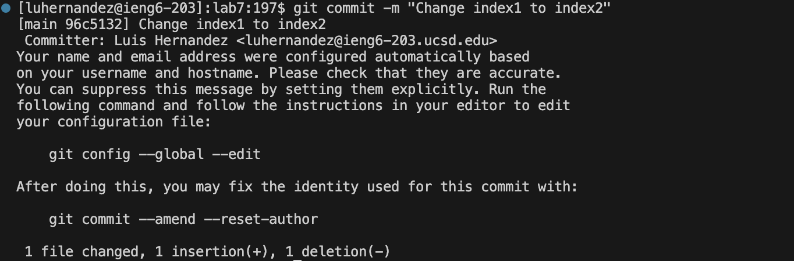
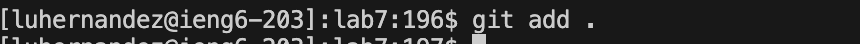

# Lab Report 4 - Vim

## Step 4

I did not have to press any keys to get access to my ieng6 account as I already have it in my remote explorer.
## Step 5

Keys pressed: I first copied the SSH URL. Then I typed in git `<Space>` clone to use the git clone command. Then I used `Command-V`, to paste the SSH URL into the terminal, then `<Enter>`.

For Step 5, I had to clone the fork into my repository using the SSH URL.
## Step 6

Keys pressed: Bash `<Space>` test.sh
For Step 6, in order to make the tests run, I had to use the bash command, which makes the bash file run, I had to use the `test.sh` bash file in order to make the tests run.
## Step 7

Keys pressed: vim `<Space>` `ListExamples.java`
## Step 8

## Step 9

