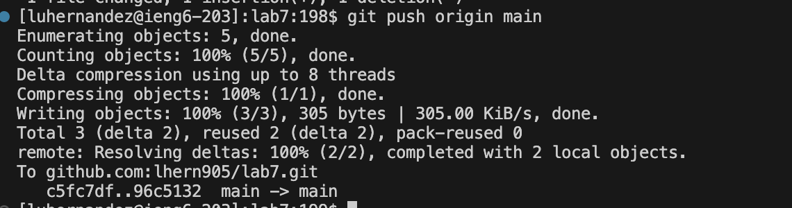

# Lab Report 4 - Vim

## Step 4

I did not have to press any keys to get access to my ieng6 account as I already have it in my remote explorer.
## Step 5

Keys pressed: I first copied the SSH URL. Then I typed in git `<Space>` clone to use the git clone command. Then I used `Command-V`, to paste the SSH URL into the terminal, then `<Enter>`.

For Step 5, I had to clone the fork into my repository using the SSH URL.
## Step 6

Keys pressed: Bash `<Space>` test.sh
For Step 6, in order to make the tests run, I had to use the bash command, which makes the bash file run, I had to use the `test.sh` bash file in order to make the tests run.
## Step 7

Keys pressed: vim `<Space>` `ListExamples.java`. 43X`<Down>` 11X`<Right>`. Press `x` key, then `i` key, then `2` key, then `<esc>`, finally used the `:wq!` command.

For step 7,I started by accessing the ListExamples.java file by using the vim command, then I used the down button 43 times, then the left button 11 times. I then pressed the x key to delete  the 1. Then I used, the i key to insert key,I pressed the 2 key to insert it so that the code would work as intended. I then pressed the esc key to get out of insert mode. Finally I used the :wq! command in order to save the changes I made and exit vim.
## Step 8

Keys pressed: `<Up>` `<Up>` `<Enter>`

For Step 8 I only had to press the up arrow key twice and the enter key in order to run the test and make sure they pass. Since I had already used a command to make the test run, `Bash test.sh` in step 6, I was able to traverse the bash history in otder to get access to the command without having to type it out again.
## Step 9

Keys pressed: git `<Space>` add . git `<Space>` commit -m "Change index1 to index2" git `<Space>` push `<Space>` origin `<Space>` main.

For Step 9 I first had to tell the git command what changes I wanted to add to include in the commit, which used the `git add` command. Then I had to commit them to my repository and I included a message of what changes I made using the `git commit -m "index1 to index2"`. Finally I pushed the using the `git push main origin` command, which made these changes appear in the github respository. 
