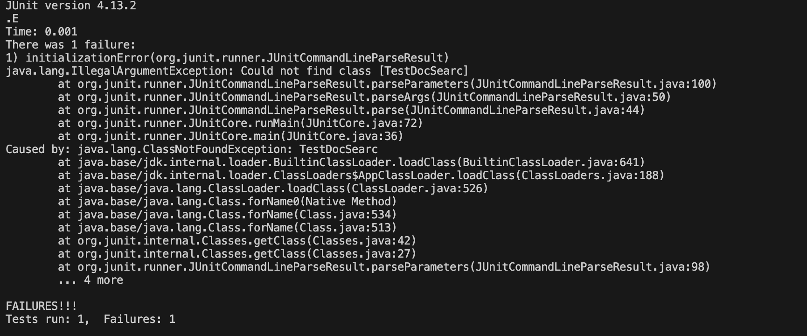
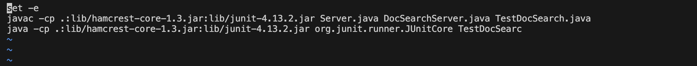
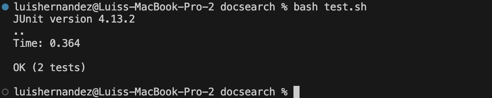

# Lab Report 5 - Putting It All Together

## Part 1 - Debugging Scenario 

Student: I am confused on why I am getting an initalization error. I think that the error could be that the bash script is not correctly calling junit so it can set up the tests in the `TestDocSearch.java` file. I am in the `docsearch` directory .Here is what the output was of me running `bash test.sh`:

TA: Hi, looking at the screen shot you sent it seems like it can be an issue with the bash script. Can you send a screenshot of the bash script so I can get a better look at what the problem could be. You could use the `vim` command with the bash script you are using so the script can show in the command line.

Student: I used the `vim test.sh` command and it displayed this

TA: Okay the error is that in the third line it says `TestDocSearc` when it should say `TestDocSearch`. Change it to say `TestDocSearch` then rerun the bash script with `test.sh`.

Student: It is now passing the tests. Thank You.

## Part 2 - Reflection
Something that I learned in the second half of the quarter was the different commands we learned in vimtutor. Such as `o` to make a new line as well as `CTRL-R` to undo a command. Something cool I figured out on my own while buulding on labs was that in jdb you can assign varbiables new values through a `set` command. Another thing I learned in the second half of the quarter through lab expereince is that you can use the `tab` key in order to finish what directory or file you are typing in. This has saved me a lot of time when writing commands in the command line and I had to type out a large file.
